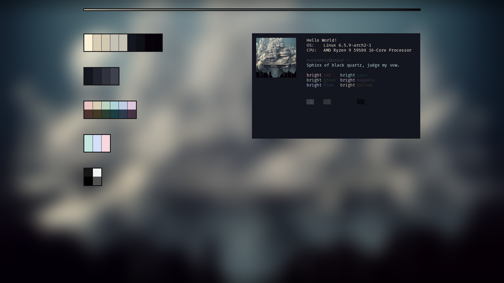

# nuunamnir.qtile-theme-generator
## Description
A script that generates a color theme for my [qtile window manager configuration](https://github.com/nuunamnir/nuunamnir.dot-files) based on an "arbitrary" input image.
## Usage
To generate a theme from an input image like this:  
  
Simply run the following line - with the `-h` argument, you can see the available other options.
```
./inanna.py input_image.jpg
```
## Output
The output is a folder containing a json file and a resized wallpaper file that can be loaded by my qtile window manager configuration; for the above image the following theme was generated:  
